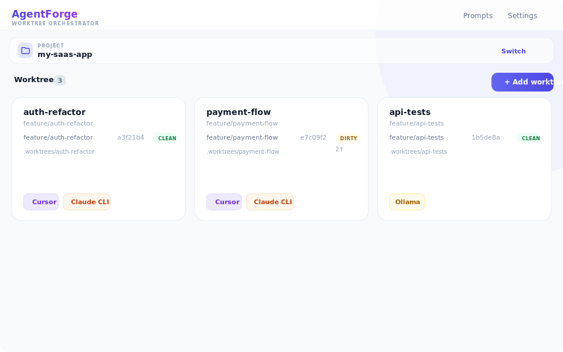
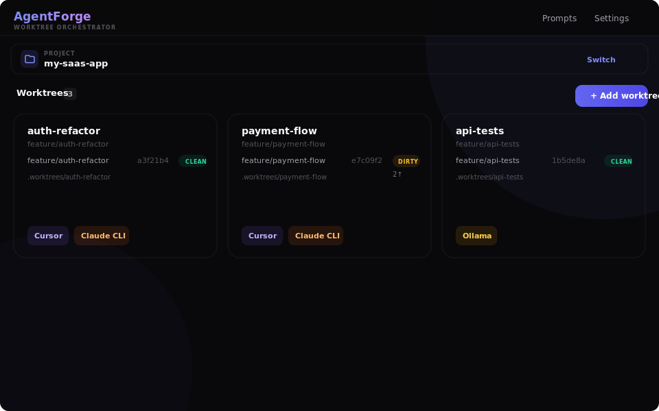
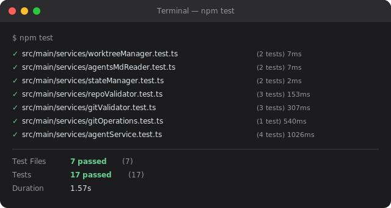

# AgentForge

**Run multiple AI coding agents in parallel — each in its own isolated Git worktree.**

Stop waiting for one agent to finish before starting the next. AgentForge lets you spin up isolated workspaces, assign tasks, and launch Cursor, Claude CLI, or a local Ollama model — all from a single dashboard. Every agent gets its own branch, its own directory, and zero merge conflicts with the others.

> **Note:** This project was fully vibe-coded with AI assistance. Every line of code, architecture decision, and UI pixel was generated through conversational prompting with Claude.

---

## Why AgentForge?

| Problem | AgentForge solution |
|---------|-------------------|
| AI agents overwrite each other's changes | Each agent works in an **isolated Git worktree** with its own branch |
| Switching between agent sessions is tedious | **One dashboard** to create, monitor, and launch all agents |
| Setting up worktrees manually is error-prone | **One click** to create a worktree, branch, and open your tool |
| No offline option for AI coding | **Claude + Ollama** mode runs entirely on your machine |
| Hard to manage prompts across agents | **Built-in prompt library** with per-tool and per-project scoping |

### Built for teams and solo devs who use AI heavily

- **Parallel execution** — 5 agents, 5 features, one repo, zero conflicts
- **Tool-agnostic** — Cursor, Claude CLI, or Ollama. Mix and match per task.
- **Git-native** — real worktrees, real branches, real commits. No magic layers.
- **Offline-ready** — fly at 35,000 feet and keep shipping with local models
- **Dark mode** — because you'll be staring at this all day

---

## Screenshots

### Light mode

<p align="center">
  
</p>

### Dark mode

<p align="center">
  
</p>

### All tests passing

<p align="center">
  
</p>

---

## Prerequisites

- **macOS** (Electron builds target macOS; other platforms are untested)
- **Node.js** >= 18
- **npm** >= 9
- **Git** >= 2.20 (worktree support required)
- At least one AI coding tool installed:
  - [Cursor](https://cursor.sh/) — AI-powered code editor
  - [Claude CLI](https://docs.anthropic.com/en/docs/claude-code) — Anthropic's command-line coding agent
  - [Ollama](https://ollama.com/) — local LLM runner (for offline use with Claude CLI)

## Getting Started

```bash
# Clone the repo
git clone https://github.com/MarianZoll-Bain/agent-forge.git
cd agent-forge

# Install dependencies
npm install

# Start in development mode
npm run dev
```

On first launch, the onboarding wizard walks you through:

1. **Enable tools** — toggle Cursor, Claude CLI, or Claude + Ollama. Each is verified automatically.
2. **Select a project** — pick any Git repository with a remote origin.
3. **Start building** — create worktrees, assign tasks, and run agents.

## Scripts

| Command | Description |
|---------|-------------|
| `npm run dev` | Start Electron dev server with hot reload |
| `npm run build` | Production build (output in `out/`) |
| `npm test` | Run unit tests (Vitest) |
| `npm run test:watch` | Run tests in watch mode |

## Offline Mode (Claude + Ollama)

For fully offline use (e.g. on a plane), use **Claude + Ollama** as the provider:

1. Install and run [Ollama](https://ollama.com/): `ollama serve`, then `ollama pull <model>` (e.g. `qwen3-coder`).
2. In the app: **Settings → Ollama** — set server URL and default model.
3. Create a worktree, choose **Claude + Ollama** as the tool, and run. Everything stays local.

## Tech Stack

- **Electron 33** — desktop shell
- **React 18** — UI framework
- **TypeScript** (strict) — type safety throughout
- **Vite / electron-vite** — fast bundling and HMR
- **Tailwind CSS** — utility-first styling with dark mode
- **Zustand** — lightweight state management
- **Zod** — runtime validation for IPC and settings

## Architecture

```
src/
  main/           # Electron main process
    services/     # Business logic (state, worktrees, agent execution)
  renderer/       # React UI
    components/   # PascalCase .tsx components
    store/        # Zustand store
  preload/        # Secure IPC bridge
  shared/         # Types and IPC channel contracts
```

Key design decisions:

- **Pluggable agent executors** — no provider branching in app logic; each tool lives in its own provider module
- **Git safety** — all git commands use argument arrays (never string-concatenated shell commands)
- **Secure IPC** — context isolation enabled, preload exposes only allowlisted methods, all inputs validated with Zod
- **Atomic state** — all reads/writes go through StateManager with file locking and version migrations

See `architecture/adr/` for detailed Architecture Decision Records.

## License

This project is licensed under the [MIT License](LICENSE).
